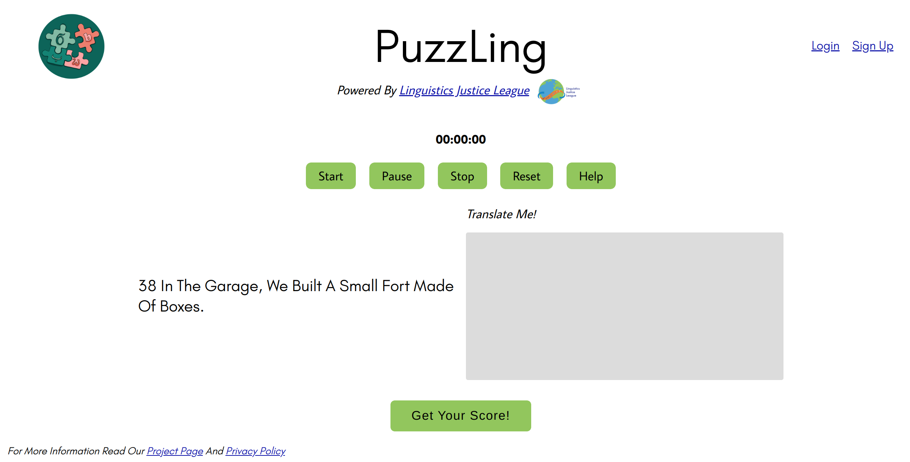
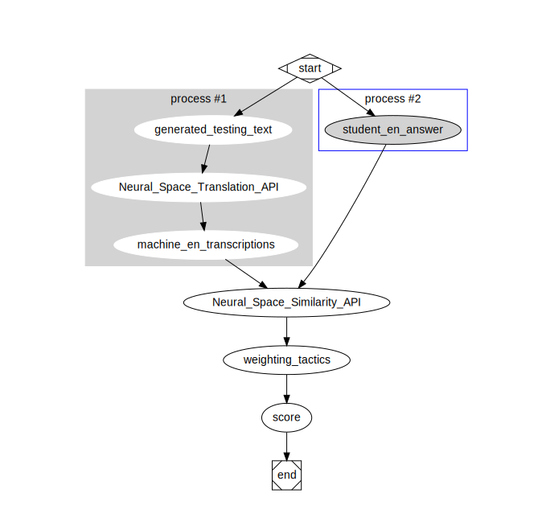

# PuzzLing and Scoring System 
## Mockup Preview
### Folder Structure
```sh 
.
├── .idea
├── Data        # the dir for storing the testing and validation corpus
│   ├── arabic_text.txt      # the Arabic sentences in formats  
│   ├── english_text.txt      # the English sentences in formats and in parallel with the arabic           
│   ├── WikiQAArticlesCorpusAr-En.tsv      # the short phrases  
│   ├── WikiQAQuestionsCorpusAr-En.tsv     # the long sentences
├── static      # include all the styling files for the front-end
│   ├── img
│   │   ├── fonts
│   │   └── styles
│   ├── styles                      
│   │   ├── style.css
├── templates   # the web structure of the frontend
│   │   ├── index.html
│   │   ├── score.html
├── README.md
├── app.py      # the python Flask web deploying file
├── get_data.py      # the corpus cleanning scripts  
├── logic.svg
├── logic_graphviz.gv
.
```


### Main Window
<div align="center">
  
</div>

### Scoring Feedback Window
<div align="center">
  
</div>


## What is PuzzLing?

**PuzzLing** combines the full system for the CALL(Computer Assisted Language Learning) platform especially focusing on low-resource languages, which includes language scoring and feedback functions. With the support from the latest language processing toolkit of the Neural Space, we aim to give a  general evaluation and retrieve the error places that the testers can improve. 


Our related using area can be automatic language scoring, evaluation, derivation— L2 teaching, Education of English as Foreign Language, etc. 


## What is new about PuzzLing compared with other platform?

For our target testers, their mother tongue (L1s) varies from many kinds of low resource languages such as Pashto, Arabic and Hindi, etc. And we intend to expand the scale of our current testing languages continuously in the future. To the best of our knowledge, our platform can be  the first proposed  non-native English scoring system for people who are speaking low-resource languages.


## Motivation

As we know, although the English language scoring system has made a promising breakthrough these years. Also, the Duolingo or Tofel already had their automatic language scoring system released, still, there is no total system that can efficiently work on especially focusing on low-resource languages (as far as the best we know). And this will be a big burden for those new-learners to learn English.

In the future, we have a strong belief that our Platform for those non-native English speakers will grow significantly. Meanwhile, we can help those low-source language speakers for our humanity.


## How PuzzLing work?

### Scoring and Testing Setup

Our system working flows from defining our problem to the conclusion and future works to compare the tester's textual input with pre-trained neural network model pipeline output (with the Support from the Neural Space API). 


<div align="center">
  
</div>

After the tester's testing data input into our scoring platform we build, and get the original text data passed through the Neural Space translation API pipeline, we can get the transcripted English result. We calculate the similarities score between those two results. 

By comparing the difference between those two data and applied those weighting tactics, we can directly know how the tester's English language level.


